# NVC Guide 全仓架构审计报告

> **审计日期**: 2026-08-10  
> **审计范围**: 后端 7 个业务模块 + 1 个通用基础设施层 + 前端 React SPA  
> **技术栈**: Spring Boot 4.0 / Java 21 / Spring AI 2.0 / React 18 / PostgreSQL+pgvector / Redis / MinIO(RustFS)  
> **状态标注**: shipped = 已上线 / parked = 写了但未接入 / planned = 仅有设计

---

## 目录

1. [系统上下文](#1-系统上下文)
2. [端到端主流程](#2-端到端主流程)
3. [数据生命周期](#3-数据生命周期)
4. [核心变换流](#4-核心变换流)
5. [集成与发布流](#5-集成与发布流)
6. [控制与编排循环](#6-控制与编排循环)
7. [治理与护栏](#7-治理与护栏)
8. [模块事实清单](#8-模块事实清单)
9. [跨模块依赖图](#9-跨模块依赖图)
10. [已知问题与待办](#10-已知问题与待办)
11.["改哪里？"速查表](#11-改哪里速查表)

---

## 1. 系统上下文

NVC Guide 后端是单体 Spring Boot 应用，通过 REST API + SSE + WebSocket 对外提供服务。下图展示所有外部系统依赖及其交互协议。

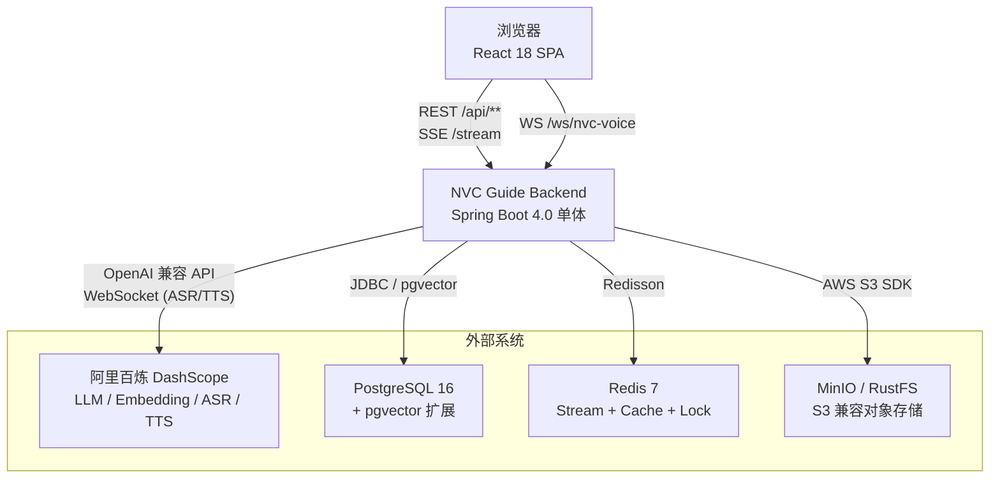

**外部系统职责**:

| 系统 | 协议 | 用途 | 关键配置路径 |
|------|------|------|-------------|
| DashScope | OpenAI 兼容 HTTP + WebSocket | LLM 对话/结构化输出、向量嵌入、实时 ASR、实时 TTS | `app.ai.providers.dashscope.*` |
| PostgreSQL | JDBC | 全部业务数据 + pgvector 向量存储 | `spring.datasource.*` |
| Redis | Redisson | 分布式锁、滑动窗口限流、Stream 异步任务、会话缓存 | `spring.data.redis.*` |
| MinIO/RustFS | S3 SDK | 知识库文档文件存储 | `app.storage.*` |

---

## 2. 端到端主流程

下图展示一次完整的 **文本练习对话** 从 HTTP 请求到持久化的全链路，标注了每个决策节点对应的代码模块。

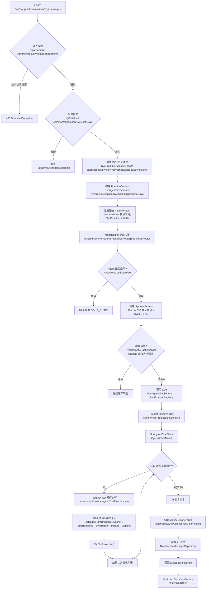

**关键决策节点说明**:

| 决策节点 | 代码位置 | 决策逻辑 |
|----------|----------|----------|
| 输入校验 | `PromptInjectionDetector.java:13-69` | 练习消息 2000 字符 / 助手消息 4000 字符；正则匹配 19 种注入模式 (8 英文系统级 + 3 英文角色劫持 + 5 中文注入 + 3 指令泄露) |
| 限流 | `RateLimitAspect.java:35-259` | Lua 滑动窗口令牌桶，支持 GLOBAL/IP/USER 三维 |
| 模式路由 | `ScenarioRouter.java` / `FreeDialogRouter.java` / `StructuredRouter.java` | 按练习模式 + 阶段 + 轮次决定下一个 Agent 场景 |
| 工具调用循环 | `AgentLoop.java:49-402` | 最多 10 轮，总超时 120s |
| Hook 链 | `ToolExecutor.java:193-294` | @Order(1-7) before → 执行 → @Order(7-1) after，SKIP 短路 |
| LLM 降级 | `LlmFallbackHandler.java:26-118` | 3 次重试 (shipped); 27 个 NVC 引导模板在 `DialogFallbackTemplates.java` (parked, 未被任何类引用) |

---

## 3. 数据生命周期

### 3.1 实体关系总览

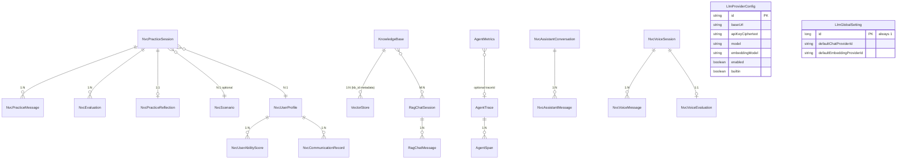

### 3.2 练习会话状态机

```mermaid
stateDiagram-v2
    [*] --> CREATED : createSession()
    CREATED --> IN_PROGRESS : 首条用户消息
    CREATED --> COMPLETED : 直接结束
    IN_PROGRESS --> PAUSED : pauseSession()
    IN_PROGRESS --> COMPLETED : completeSession()
    PAUSED --> IN_PROGRESS : resumeSession()
    PAUSED --> COMPLETED : completeSession()
    COMPLETED --> EVALUATED : evaluateFinal()
    EVALUATED --> [*]

    note right of CREATED : NvcPracticeSessionService:47-53\nVALID_TRANSITIONS 强制校验
    note right of COMPLETED : Redis 分布式锁 nvc:practice:complete:{sessionId}\n防止重复评估
    note right of EVALUATED : 发布 PracticeCompletedEvent\n触发异步 Wiki 生成
```

**状态转换校验** (`NvcPracticeSessionService.java:47-53`): `@PostConstruct` 验证所有枚举值均有对应转换规则，运行时通过 `VALID_TRANSITIONS` Map 强制执行。

### 3.3 知识库向量化生命周期

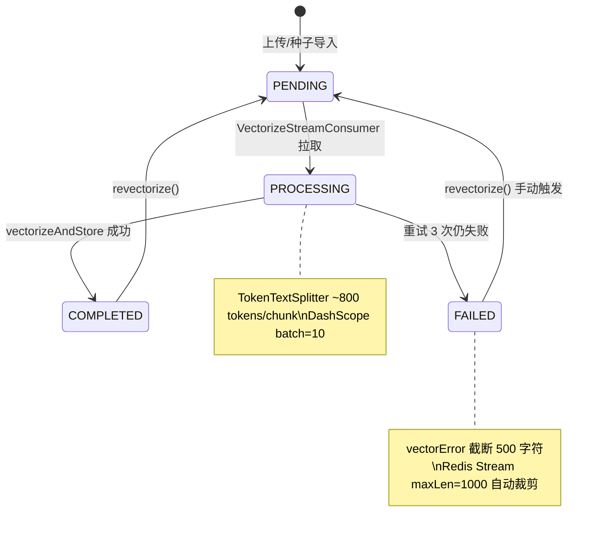

---

## 4. 核心变换流

### 4.1 LLM 请求完整链路

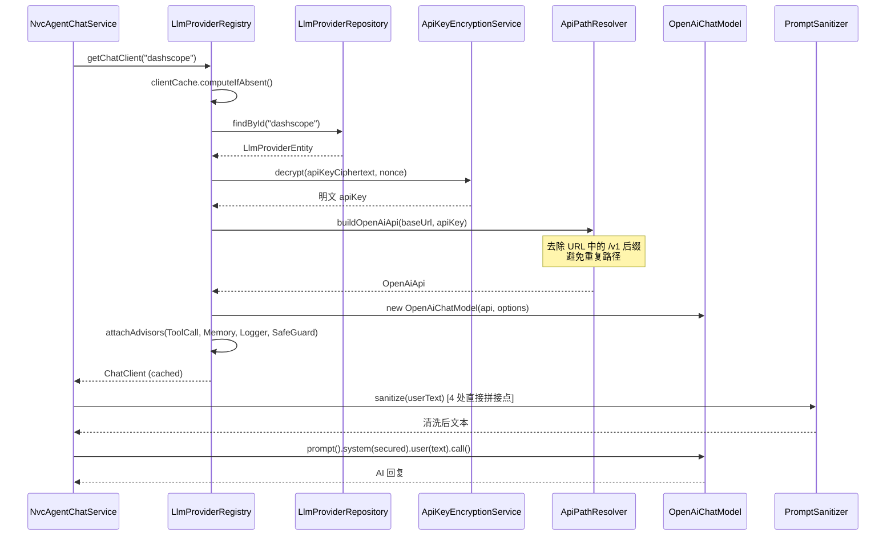

**三种 ChatClient 变体**:

| 变体 | 方法 | 用途 | 工具 | 记忆 | 代码行 |
|------|------|------|------|------|--------|
| Default | `getChatClient()` | 主助手对话 | SkillsTool | MessageChatMemoryAdvisor | `LlmProviderRegistry.java:102` |
| Plain | `getPlainChatClient()` | 结构化输出(评估/生成) | 无 | 无 | `LlmProviderRegistry.java:132` |
| Voice | `getVoiceChatClient()` | 语音练习 | SkillsTool | 无(手动管理) | `LlmProviderRegistry.java:141` |

### 4.2 结构化输出变换

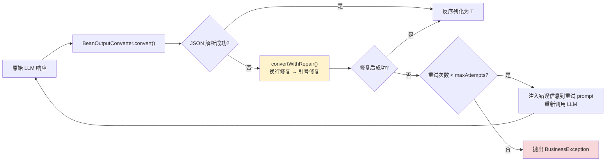

**代码位置**: `StructuredOutputInvoker.java:19-331`，默认 `maxAttempts=2` (`StructuredOutputProperties.java:9-18`)。

### 4.3 异步任务管道 (Redis Stream)

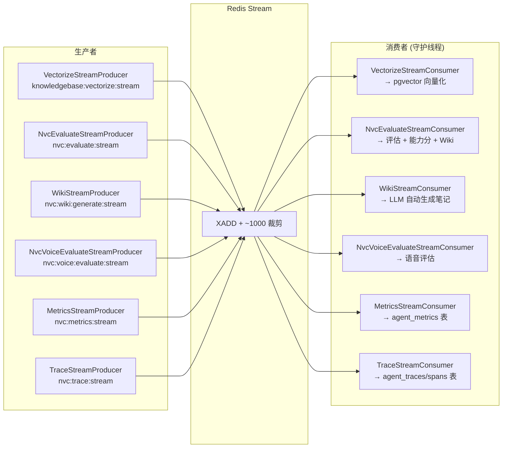

**统一基类**: `AbstractStreamProducer` / `AbstractStreamConsumer` (`common/async/`)。消费者统一重试 3 次，失败标记 FAILED，错误消息截断 500 字符。Stream maxLen=1000 使用 `~` 近似裁剪 (`AsyncTaskStreamConstants.java:45`)。

---

## 5. 集成与发布流

### 5.1 外部 LLM 供应商集成

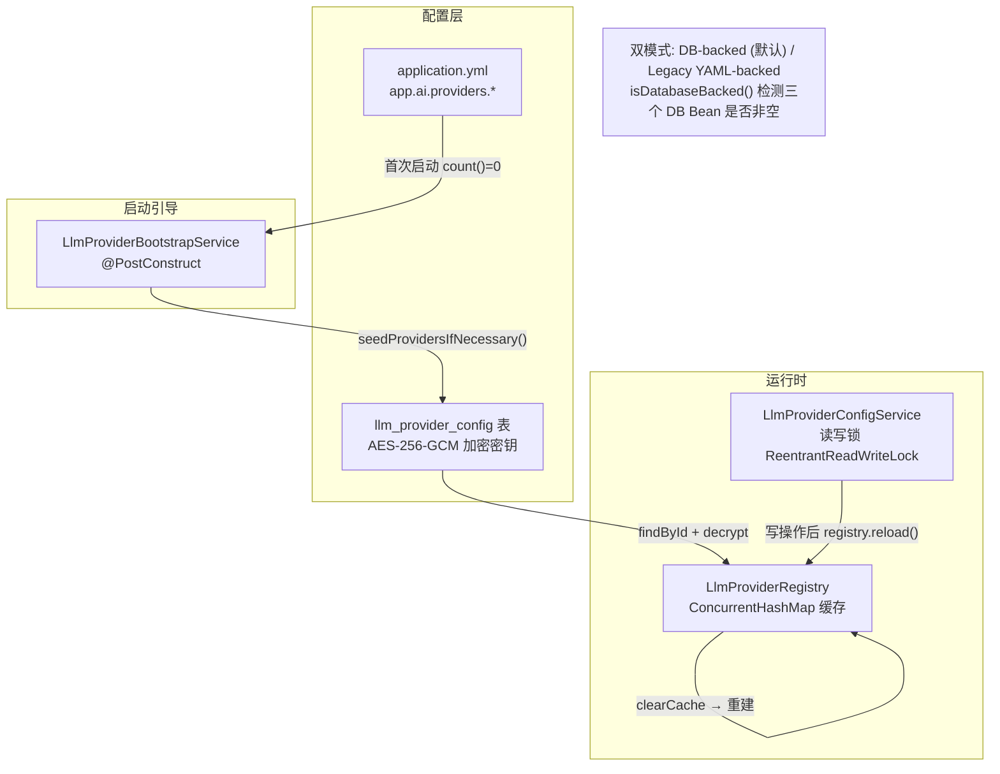

**API Key 加密** (`ApiKeyEncryptionService.java:19-109`): AES-256-GCM，12 字节 nonce，密钥从 `APP_AI_CONFIG_ENCRYPTION_KEY` 环境变量派生 (Base64 解码或 SHA-256)。开发环境有硬编码 fallback key (`ApiKeyEncryptionService.java:24-25`)。

### 5.2 知识库文档发布流

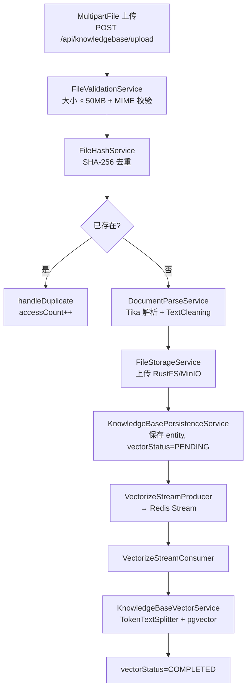

**种子知识库** (`SeedKnowledgeBaseService.java:33-284`): `ApplicationReadyEvent` 触发，扫描 `classpath:knowledge/{theory,vocabulary,templates,cases}/*.md` (15 个文件)，SHA-256 幂等导入。根目录下 4 个 `.md` 文件 **不在种子范围内**，属于孤立文件。

---

## 6. 控制与编排循环

### 6.1 NvcAssistant Agent 循环

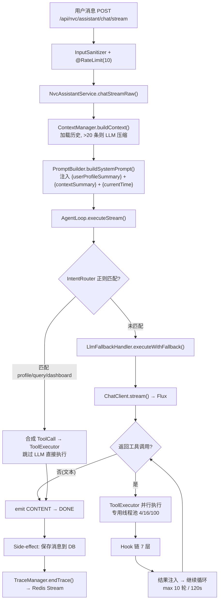

**Hook 链执行顺序** (`ToolExecutor.java:193-294`):

| @Order | Hook | before | after | 职责 |
|--------|------|--------|-------|------|
| 1 | RateLimitToolHook | 滑动窗口限流 | - | 5/hr(scenario), 20/hr(eval), 30/min(默认) |
| 2 | PermissionToolHook | 权限检查 | - | scenario_generate/evaluate_nvc 需 ≥1 次练习 |
| 3 | CacheToolHook | 缓存命中检查 | 缓存写入 | dashboard(5m), profile(10m), rag/wiki(30m) |
| 4 | ErrorEnhanceHook | - | 错误增强 | 失败工具注入 RAG 兜底知识 |
| 5 | EvaluationTriggerHook | - | Wiki 自动生成 | evaluate_nvc 成功后异步触发 |
| 6 | PersistToolHook | 记录开始时间 | 持久化记录 | nvc_tool_call_records 表 |
| 7 | LoggingToolHook | 日志 | 日志 | 始终 PROCEED |

### 6.2 语音练习实时管道

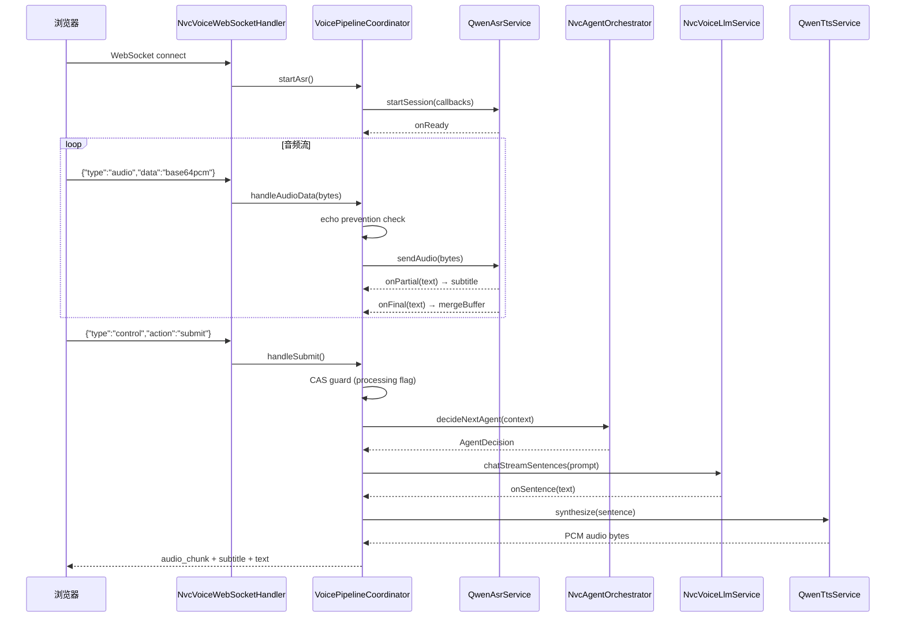

**关键约束**:
- 回声消除: AI 说话期间 + 800ms 内丢弃麦克风输入 (`SessionState.java:33-39`)
- CAS 并发保护: 同一 session 同一时间只允许一个 LLM 处理 (`VoicePipelineCoordinator.java:155`)
- TTS 每次合成新建 WebSocket 连接，延迟较高 (`QwenTtsService.java:44-311`)
- `OrderedTtsChunkEmitter` 已实现但 **未接入** (`parked`)，音频块不保序

---

## 7. 治理与护栏

### 7.1 安全防线层次

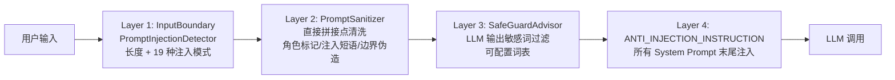

**代码锚点**:
- Layer 1: `PromptInjectionDetector.java:13-69` (19 种模式: 8 英文系统级 + 3 英文角色劫持 + 5 中文注入 + 3 指令泄露)
- Layer 2: `PromptSanitizer.java:18-128` (2 处调用点 -- 仅 NvcVoiceLlmService; 类注释声称 4 处已过时)
- Layer 3: `SafeGuardAdvisor` (由 `LlmProviderRegistry.buildDefaultAdvisors()` 配置)
- Layer 4: `PromptSecurityConstants.java:9-33` (`ANTI_INJECTION_INSTRUCTION`)

### 7.2 事务与外部调用隔离

项目约束: **事务内禁止调用外部 API** (`docs/GUARDRAILS.md`)。

| 场景 | 是否遵守 | 代码位置 |
|------|----------|----------|
| NvcEvaluationService 评估 | 遵守 - `@Transactional(NOT_SUPPORTED)` | `NvcEvaluationService.java:45,69` |
| NvcPracticeDialogueService 对话 | 遵守 - 无 @Transactional | `NvcPracticeDialogueService.java:47-48` |
| KnowledgeBaseVectorService 向量化 | **违反** - `@Transactional` 内调 DashScope | `KnowledgeBaseVectorService.java:46` |
| NvcWikiService 创建 | 遵守 - 拆分事务边界 | `NvcWikiService.java:80-93` |

### 7.3 Rate Limiting 全景

| 维度 | 实现 | 存储 | 代码 |
|------|------|------|------|
| HTTP 接口级 | `@RateLimit` 注解 + Lua 脚本 | Redis Sorted Set | `RateLimitAspect.java:35-259` |
| 工具调用级 | `RateLimitToolHook` | JVM 内存 ConcurrentHashMap | `RateLimitToolHook.java:34-152` |
| 语音配置 | `NvcVoiceProperties.RateLimitConfig` | **parked: 配置存在但未实现** | `NvcVoiceProperties.java:111-117` |

**IP 限流注意**: `RateLimitAspect.getClientIp()` 不信任 `X-Forwarded-For`，在反向代理后所有请求显示为代理 IP，IP 限流失效 (`RateLimitAspect.java:232-236`)。

### 7.4 全局异常处理

`GlobalExceptionHandler.java:25-199` 捕获所有异常并映射为 `Result<Void>`。SSE 请求通过 Accept header 或 URL `/stream` 后缀检测，异常被静默吞掉 (返回 null)。`ErrorCode` 枚举定义 40+ 错误码，范围: 1xxx(通用) / 3xxx(NVC) / 4xxx(存储) / 5xxx(导出) / 6xxx(知识库) / 68xx(Wiki) / 69xx(助手) / 7xxx(AI) / 8xxx(限流) / 10xxx(语音) / 11xxx(供应商)。

---

## 8. 模块事实清单

### 8.1 后端模块

| 模块 | 包路径 | 职责 | 实体数 | API 端点数 | 状态 |
|------|--------|------|--------|-----------|------|
| common/infra | `nvc.guide.common.*` + `nvc.guide.infrastructure.*` | LLM 注册、安全、限流、文件、导出 | 0 | 0 | shipped |
| knowledgebase | `nvc.guide.modules.knowledgebase` | RAG 知识库 + RagChat | 3 | ~15 | shipped |
| llmprovider | `nvc.guide.modules.llmprovider` | LLM 供应商 CRUD + ASR/TTS 配置 | 2 | 15 | shipped |
| nvcassistant | `nvc.guide.modules.nvcassistant` | AI 助手 Agent 循环 + Trace + Metrics | 5 | ~12 | shipped |
| nvcpractice | `nvc.guide.modules.nvcpractice` | 练习引擎(3 模式) + 12 Agent 场景 | 8 | ~20 | shipped |
| nvcprofile | `nvc.guide.modules.nvcprofile` | 用户画像 + 能力雷达 + 沟通分析 | 3 | 6 | shipped |
| nvcscenario | `nvc.guide.modules.nvcscenario` | 场景目录 + LLM 生成 | 1 | 3 | shipped |
| nvcvoice | `nvc.guide.modules.nvcvoice` | 实时语音练习(ASR/LLM/TTS) | 3 | 5 + WS | shipped |
| nvcwiki | `nvc.guide.modules.nvcwiki` | 个人知识笔记 | 0(复用 knowledge_bases) | 6 | shipped |

### 8.2 前端路由

| 路由 | 页面 | 核心交互 |
|------|------|----------|
| `/nvc` | 练习中心 | 模式卡片 + 难度选择 + 语音入口 |
| `/nvc/practice/:sessionId` | 文本练习 | SSE 流式对话 + 四要素摘要 + 步骤指示器 |
| `/nvc/voice/:sessionId` | 语音练习 | WebSocket + 实时字幕 + 音频播放 |
| `/nvc/assistant` | AI 助手 | SSE typed events + 工具调用卡片 |
| `/nvc/wiki` | 个人笔记 | CRUD + 语义搜索 |
| `/knowledgebase` | 知识库管理 | 上传/列表/状态轮询 |
| `/knowledgebase/chat` | RAG 对话 | SSE 流式问答 |
| `/nvc/dashboard` | 仪表盘 | 能力雷达图 + 趋势图 + 统计 |
| `/nvc/profile` | 个人档案 | 画像编辑 + 能力趋势 |
| `/nvc/scenarios` | 场景库 | 筛选 + LLM 生成 |
| `/settings` | 系统设置 | 供应商 CRUD + ASR/TTS 配置 |
| `/nvc/traces` | Trace 可观测 | 链路时间线 + 过滤 + 统计 |

---

## 9. 跨模块依赖图

```mermaid
flowchart TD
    subgraph Common["common + infrastructure"]
        LLM["LlmProviderRegistry"]
        EVAL["UnifiedEvaluationService"]
        CACHE["RedisService"]
        FILE["FileStorageService"]
        ASYNC["AbstractStreamProducer/Consumer"]
        SEC["InputSanitizer / PromptSanitizer"]
    end

    subgraph Practice["nvcpractice"]
        ORCH["NvcAgentOrchestrator"]
        CHAT["NvcAgentChatService"]
        TOOL["NvcToolRegistry"]
        ROUTER["ModeRouter × 3"]
        EVALSVC["NvcEvaluationService"]
    end

    subgraph Assistant["nvcassistant"]
        AGENTLOOP["AgentLoop"]
        TOOLEXEC["ToolExecutor"]
        HOOKS["NvcToolHook × 7"]
        TRACE["TraceManager"]
    end

    subgraph Profile["nvcprofile + nvcscenario"]
        PROF["NvcProfileService"]
        SCEN["NvcScenarioService"]
    end

    subgraph KB["knowledgebase"]
        VEC["KnowledgeBaseVectorService"]
        QUERY["KnowledgeBaseQueryService"]
        RAGCHAT["RagChatSessionService"]
    end

    subgraph Voice["nvcvoice"]
        PIPE["VoicePipelineCoordinator"]
        ASRSVC["QwenAsrService"]
        TTSSVC["QwenTtsService"]
    end

    ORCH --> CHAT
    ORCH --> ROUTER
    ORCH --> PROF
    ORCH --> VEC : "RAG 检索"
    CHAT --> LLM
    CHAT --> TOOL
    EVALSVC --> LLM
    EVALSVC --> PROF : "能力分写回"
    AGENTLOOP --> LLM
    AGENTLOOP --> TOOLEXEC
    TOOLEXEC --> HOOKS
    AGENTLOOP --> TRACE
    PIPE --> ORCH
    PIPE --> ASRSVC
    PIPE --> TTSSVC
    PIPE --> LLM : "Voice ChatClient"
    PROF --> SCEN : "场景推荐依赖画像"
    QUERY --> VEC
    RAGCHAT --> QUERY
    VEC --> LLM : "EmbeddingModel"

    style ORCH fill:#e1f5fe
    style AGENTLOOP fill:#e1f5fe
    style LLM fill:#fff9c4
```

**循环依赖警告**: `NvcToolRegistry → NvcTool 实现 → NvcAgentOrchestrator (@Lazy) → NvcAgentChatService → NvcToolRegistry`。通过 `spring.main.allow-circular-references: true` (`application.yml:29`) 临时解决。

---

## 10. 已知问题与待办

### 10.1 架构级问题 (按严重度排序)

| # | 严重度 | 问题 | 位置 | 影响 |
|---|--------|------|------|------|
| 1 | **高** | `vectorizeAndStore()` 在 `@Transactional` 内调用 DashScope 嵌入 API | `KnowledgeBaseVectorService.java:46` | DB 连接被慢速外部调用占用，连接池耗尽风险 |
| 2 | **高** | 无认证体系：前端 userId 为随机 6 位数，后端从 `@RequestParam` 取 userId | `NvcAssistantController.java:38-40`，`useUserId` hook | 任意用户可冒充其他用户 |
| 3 | **高** | Trace/Metrics 管理 API 无鉴权 | `TraceController.java:29-32`，`MetricsController.java:16-17` | 内部数据泄露 |
| 4 | **中** | ContextManager 无法重建历史工具调用 (AssistantMessage 不可变) | `ContextManager.java:252-283` | 压缩后 LLM 丢失工具调用上下文 |
| 5 | **中** | `looksLikeChatModel()` 启发式在两处重复 | `LlmProviderConfigService.java:812-819` vs `LlmProviderRegistry.java:403-411` | DRY 违反，维护不同步风险 |
| 6 | **中** | 语义缓存已实现但未接入对话流 | `NvcSemanticCacheService.java` | 冗余 LLM 调用未被节省 |
| 7 | **中** | A/B 测试 Prompt 版本路由已实现但未接入 | `NvcPromptVersionService.selectVersion()` | 流量分割功能闲置 |
| 8 | **中** | EvaluationFallbackService 已实现但未被调用 | `EvaluationFallbackService.java` | LLM 失败时无降级评分 |
| 9 | **低** | Wiki 的 `fileHash` 用 `content.hashCode()` (32 位) 参与 SHA-256 | `NvcWikiService.java:233` | 不同内容 hashCode 相同时唯一约束冲突 |
| 10 | **低** | PDF 导出中文显示为方块 | `PdfExportService.java:55-56` | 生产环境 PDF 报告不可读 |
| 11 | **低** | IP 限流不信任 X-Forwarded-For | `RateLimitAspect.java:232-236` | 反向代理后 IP 限流失效 |
| 12 | **低** | NvcFeedbackButtons 硬编码 userId=1 | `NvcFeedbackButtons.tsx:39` | 所有反馈归属用户 1 |
| 13 | **低** | 语音 RateLimit 配置存在但未实现 | `NvcVoiceProperties.java:111-117` | 语音接口无限流保护 |

### 10.2 Parked / 未接入组件

| 组件 | 状态 | 说明 |
|------|------|------|
| `NvcSemanticCacheService` | parked | 语义缓存已实现，`NvcAgentChatService` 未调用 |
| `NvcPromptVersionService.selectVersion()` | parked | A/B 路由已实现，`NvcAgentConfigService.getConfig()` 未咨询 |
| `EvaluationFallbackService` | parked | 关键词降级评分已实现，`NvcEvaluationService` 未调用 |
| `OrderedTtsChunkEmitter` | parked | 有序 TTS 发射器已实现，`VoicePipelineCoordinator` 未使用 |
| `TraceSampler` | parked | 采样器已实现，`TraceManager.startTrace()` 未调用 |
| `PracticeCompletedEvent` 监听器 | parked | 事件已发布，无 `@EventListener` 存在 |
| `DialogFallbackTemplates` (27 模板) | parked | AgentLoop 使用硬编码字符串而非模板 |
| 语音 RateLimit 配置 | parked | 配置属性存在，无执行逻辑 |

### 10.3 各报告间分歧

| 议题 | 报告 A | 报告 B | 判断 |
|------|--------|--------|------|
| 评估降级是否生效 | nvcpractice: `EvaluationFallbackService` 已实现 | nvcpractice gotchas: 从未被调用 | **未接入** — `NvcEvaluationService` 捕获异常后未回退到关键词评分 |
| 评估同步 vs 异步路径 | nvcpractice: 两条路径并存 | nvcpractice gotchas: 控制器始终用同步路径 | **同步路径为主** — Redis Stream 路径可能是遗留设计 |
| `PracticeCompletedEvent` 用途 | common: "下游监听器" | nvcpractice: "无监听器存在" | **无监听器** — 事件发布但无人消费 |

---

## 11. "改哪里？" 速查表

| 我想改... | 去哪里改 | 关键文件 |
|----------|----------|----------|
| LLM 模型/供应商切换 | LlmProvider 模块 + YAML | `LlmProviderRegistry.java`，`LlmProviderConfigService.java`，`application.yml` `app.ai.*` |
| System Prompt 内容 | 按模块找 `.st` 模板 | `resources/prompts/nvc-assistant-system-v2.st`，`nvc-evaluation-system.st`，`nvc-wiki-auto-generate.st` 等 |
| Agent 路由逻辑 | nvcpractice 路由器 | `router/ScenarioRouter.java`，`FreeDialogRouter.java`，`StructuredRouter.java` |
| 工具调用行为 | nvcpractice 工具 | `tool/*.java` (10 个 NvcTool 实现) |
| 工具调用拦截 (限流/权限/缓存) | nvcassistant Hook 链 | `service/agent/*ToolHook.java` (@Order 1-7) |
| AI 助手对话逻辑 | nvcassistant AgentLoop | `AgentLoop.java`，`ContextManager.java`，`PromptBuilder.java` |
| 练习评估评分 | nvcpractice 评估 | `NvcEvaluationService.java`，`StructuredOutputInvoker.java`，prompt 模板 |
| 知识库 RAG 查询策略 | knowledgebase 查询 | `KnowledgeBaseQueryService.java`，`KnowledgeBaseQueryProperties.java` |
| 向量化参数 | knowledgebase 向量 | `KnowledgeBaseVectorService.java` (chunk size, batch size) |
| 语音 ASR/TTS 配置 | nvcvoice 供应商 | `QwenAsrService.java`，`QwenTtsService.java`，`NvcVoiceProperties.java` |
| 语音对话管道 | nvcvoice pipeline | `VoicePipelineCoordinator.java`，`SessionState.java` |
| 用户画像/能力分 | nvcprofile | `NvcProfileService.java`，`NvcUserAbilityScoreEntity.java` |
| 场景生成 | nvcscenario | `NvcScenarioService.java`，prompt 模板 |
| Wiki 自动生成 | nvcwiki | `NvcWikiAutoGenerateService.java`，prompt 模板 |
| Trace/Metrics 采集 | nvcassistant trace/metrics | `TraceManager.java`，`MetricsCollector.java`，`TraceProperties.java` |
| 异步任务管道 | common async | `AbstractStreamProducer.java`，`AbstractStreamConsumer.java`，`AsyncTaskStreamConstants.java` |
| 限流规则 | common annotation | `@RateLimit` 注解参数，`RateLimitToolHook.java` 常量 |
| 文件上传/存储 | infrastructure file | `FileStorageService.java`，`StorageConfigProperties.java` |
| 前端页面路由 | frontend | `frontend/src/App.tsx` |
| 前端 API 调用 | frontend api | `frontend/src/api/*.ts` |
| 前端 SSE 处理 | frontend utils | `frontend/src/utils/sse.ts` |
| 数据库 Schema | JPA Entity + `ddl-auto: update` | 各模块 `model/*Entity.java`（无 Flyway 迁移） |
| Redis Stream 话题 | common constants | `AsyncTaskStreamConstants.java` |
| Prompt 注入防线 | common security | `PromptInjectionDetector.java`，`PromptSanitizer.java`，`PromptSecurityConstants.java` |
| LLM 降级/重试 | nvcassistant fallback | `LlmFallbackHandler.java`，`DialogFallbackTemplates.java` |

---

## 附录: 技术债务清单

| 类别 | 项目 | 优先级 |
|------|------|--------|
| 安全 | 实现 JWT/OAuth2 认证，替换 @RequestParam userId | P0 |
| 安全 | Trace/Metrics API 加鉴权 | P0 |
| 安全 | 生产环境强制 `requireEncryptionKey=true` | P1 |
| 数据库 | 引入 Flyway 迁移，替代 `ddl-auto: update` | P1 |
| 事务 | `vectorizeAndStore()` 移除 `@Transactional`，拆分 DB 写和外部调用 | P1 |
| 代码质量 | `looksLikeChatModel()` 提取为公共工具方法 | P2 |
| 代码质量 | `NvcVoiceSessionStatus.FAILED` 删除或接入 | P3 |
| 功能 | 接入 `NvcSemanticCacheService` 到对话流 | P2 |
| 功能 | 接入 `EvaluationFallbackService` 到评估流 | P2 |
| 功能 | 接入 `NvcPromptVersionService` 到 Agent 配置 | P3 |
| 功能 | 修复 PDF 中文字体 | P2 |
| 前端 | 替换 `as any` 分页类型断言 | P2 |
| 前端 | 修复 `NvcFeedbackButtons` 硬编码 userId | P1 |
