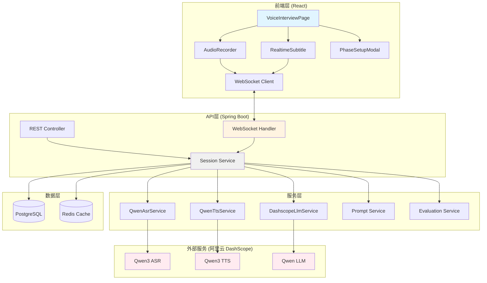
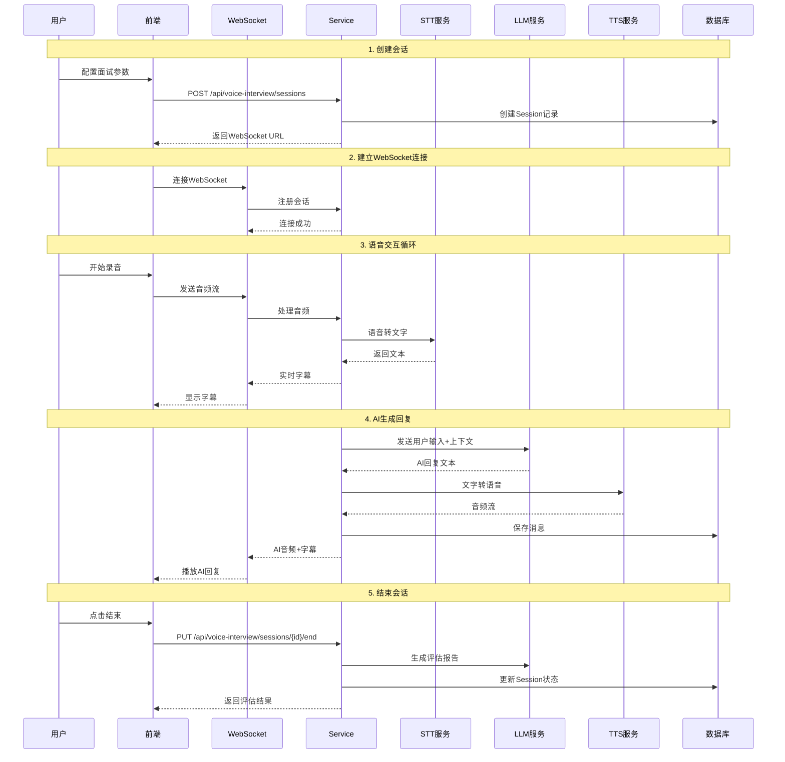
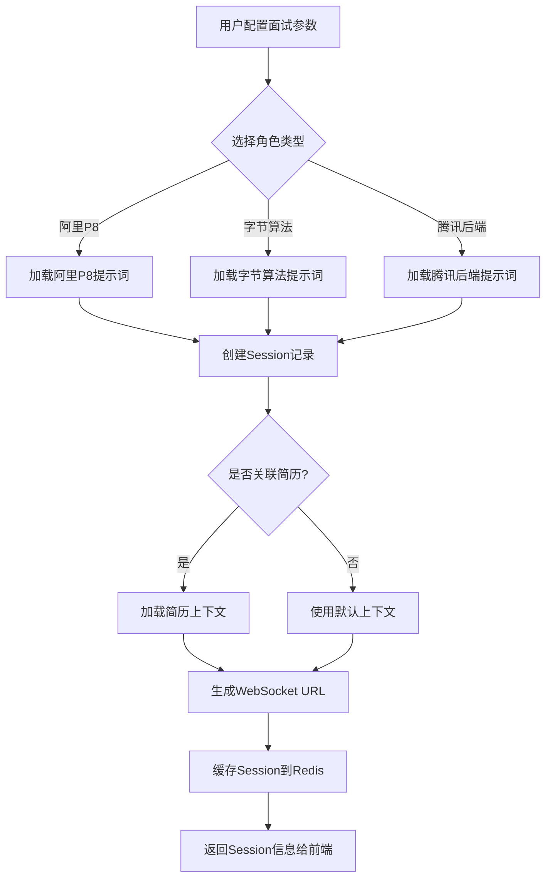
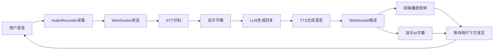
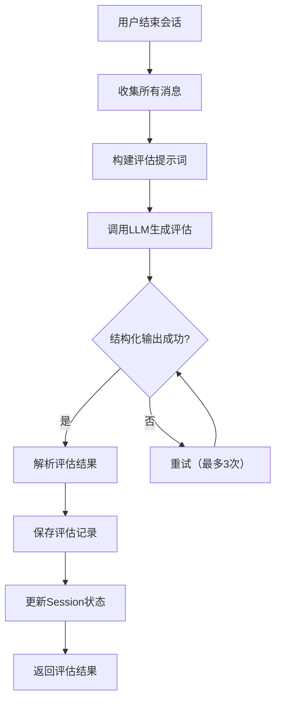
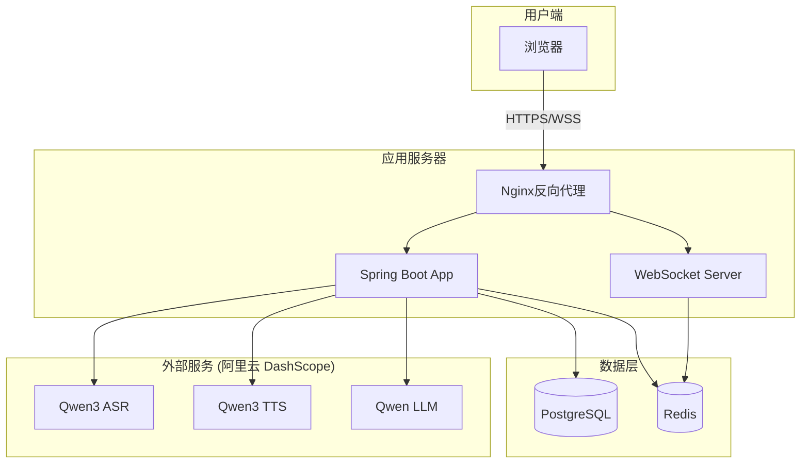

# AI 语音面试系统架构文档

> **最后更新**: 2026-04-06
> **当前版本**: Qwen3 实时语音模型

## 📋 系统概述

AI语音面试系统是一个实时语音交互的智能面试平台，集成了语音识别(ASR)、大语言模型(LLM)、语音合成(TTS)等AI能力，提供沉浸式的面试体验。

**核心技术升级**：项目已从 Aliyun NLS SDK 升级到 Qwen3 实时语音模型，实现更低延迟和更高准确率：
- **ASR 准确率**: ~95%+（提升 5%+）
- **ASR 断句延迟**: 400ms（减少 50%）
- **TTS 首包延迟**: 200ms（减少 60%）
- **配置简化**: 从 9 个环境变量减少到 2 个（统一使用 `AI_BAILIAN_API_KEY`）

## 🏗️ 系统架构图

### 整体架构



### 核心流程时序图



## 🎯 模块详解

### 1. 前端模块

#### VoiceInterviewPage
- **职责**: 主页面，协调所有子组件
- **状态管理**: 会话状态、消息历史、UI状态
- **核心功能**:
  - WebSocket连接管理
  - 面试阶段控制
  - 消息持久化显示

#### AudioRecorder
- **职责**: 音频录制和发送
- **技术**: Web Audio API + WebSocket
- **核心功能**:
  - PCM音频采集
  - 实时音频流传输
  - VAD语音活动检测
  - 录音状态管理

#### RealtimeSubtitle
- **职责**: 实时字幕显示
- **核心功能**:
  - 用户语音实时转写
  - AI回复文字展示
  - 双向字幕滚动

#### PhaseSetupModal
- **职责**: 面试配置
- **核心功能**:
  - 选择面试角色（阿里P8/字节算法/腾讯后端）
  - 配置面试阶段（自我介绍/技术/项目/HR）
  - 设置面试时长

### 2. 后端API层

#### VoiceInterviewController (REST)
```
POST   /api/voice-interview/sessions           # 创建会话
GET    /api/voice-interview/sessions/{id}      # 获取会话
PUT    /api/voice-interview/sessions/{id}/end  # 结束会话
PUT    /api/voice-interview/sessions/{id}/pause  # 暂停会话
PUT    /api/voice-interview/sessions/{id}/resume # 恢复会话
GET    /api/voice-interview/sessions           # 获取所有会话
GET    /api/voice-interview/sessions/{id}/messages # 获取消息历史
GET    /api/voice-interview/sessions/{id}/evaluation # 获取评估报告
```

#### VoiceInterviewWebSocketHandler
- **职责**: WebSocket连接和消息处理
- **协议**: 自定义JSON消息格式
- **消息类型**:
  - `AUDIO`: 音频数据
  - `SUBTITLE`: 字幕数据
  - `CONTROL`: 控制消息（开始/暂停/结束）

### 3. 服务层

#### VoiceInterviewService
- **核心职责**: 会话生命周期管理
- **关键方法**:
  - `createSession()`: 创建会话，初始化状态
  - `processAudio()`: 处理音频流，调用STT
  - `handleUserInput()`: 处理用户输入，调用LLM
  - `generateResponse()`: 生成AI回复，调用TTS
  - `endSession()`: 结束会话，生成评估
  - `pauseSession()`: 暂停会话，保存状态
  - `resumeSession()`: 恢复会话，恢复状态

#### QwenAsrService
- **职责**: 实时语音识别
- **技术**: Qwen3 ASR Flash Realtime (DashScope SDK 2.22.7)
- **模型**: qwen3-asr-flash-realtime
- **功能**:
  - PCM音频流转文字
  - 实时中间结果和最终结果
  - 服务端 VAD（语音活动检测）
  - 自动断句（400ms 静音阈值）
- **性能**:
  - 识别准确率: ~95%+
  - 断句延迟: 400ms（比传统方案快 50%）

#### DashscopeLlmService
- **职责**: LLM对话生成
- **技术**: 阿里云DashScope (qwen3.5-flash)
- **功能**:
  - 角色扮演（面试官角色）
  - 多轮对话上下文
  - 简历上下文注入
  - 流式响应（SSE）
- **支持**: 多 LLM 提供商（DashScope/MiniMax/OpenAI/DeepSeek/LM Studio）

#### QwenTtsService
- **职责**: 实时语音合成
- **技术**: Qwen3 TTS Flash Realtime (DashScope SDK 2.22.7)
- **模型**: qwen3-tts-flash-realtime
- **音色**: Cherry（温柔女声）
- **功能**:
  - 文字转语音流
  - 流式合成（边合成边播放）
  - 中文优化
  - PCM格式输出
- **性能**:
  - 首包延迟: 200ms（快 60%）
  - 语速/音量可配置

#### VoiceInterviewPromptService
- **职责**: 提示词管理
- **功能**:
  - 角色提示词模板（ST格式）
  - 简历上下文注入
  - 动态提示词生成

#### VoiceInterviewEvaluationService
- **职责**: 面试评估
- **功能**:
  - 多维度评分（技术/沟通/逻辑等）
  - 结构化输出
  - 评估报告生成

### 4. 数据模型

#### VoiceInterviewSessionEntity
```java
- id: Long                    # 会话ID
- roleType: String            # 角色类型（ali-p8/byteance-algo/tencent-backend）
- resumeId: Long              # 关联简历ID
- currentPhase: InterviewPhase # 当前阶段（INTRO/TECH/PROJECT/HR/COMPLETED）
- status: SessionStatus       # 状态（IN_PROGRESS/PAUSED/COMPLETED）
- plannedDuration: Integer    # 计划时长（分钟）
- startTime: LocalDateTime    # 开始时间
- endTime: LocalDateTime      # 结束时间
- pausedAt: LocalDateTime     # 暂停时间
- resumedAt: LocalDateTime    # 恢复时间
- actualDuration: Integer     # 实际时长（秒）
```

#### VoiceInterviewMessageEntity
```java
- id: Long                    # 消息ID
- sessionId: Long             # 会话ID
- role: MessageRole           # 角色（USER/ASSISTANT）
- content: String             # 消息内容
- audioUrl: String            # 音频URL（可选）
- timestamp: LocalDateTime    # 时间戳
```

#### VoiceInterviewEvaluationEntity
```java
- id: Long                    # 评估ID
- sessionId: Long             # 会话ID
- technicalScore: Integer     # 技术评分
- communicationScore: Integer # 沟通评分
- logicScore: Integer         # 逻辑评分
- overallScore: Integer       # 综合评分
- strengths: String           # 优势
- improvements: String        # 改进建议
- summary: String             # 总结
```

## 🔄 核心流程

### 1. 会话创建流程



### 2. 实时对话流程



### 3. 评估生成流程



## 🗂️ 数据流向

### 音频流向
```
麦克风 → AudioRecorder (PCM) → WebSocket → Service → Qwen3 ASR
    ↓
AI回复文本 → Qwen3 TTS → PCM音频 → WebSocket → AudioPlayer → 扬声器
```

### 文本流向
```
用户语音 → STT → 文本 → 字幕显示
    ↓
文本 + 上下文 → LLM → AI回复文本 → 字幕显示
    ↓
AI回复文本 → DB持久化
```

### 控制流向
```
用户操作 → REST API → Service → DB状态更新
    ↓
WebSocket消息 → Service → 状态变更 → WebSocket通知
```

## 🔐 安全与性能

### 安全措施
1. **API密钥保护**: 环境变量存储，不提交代码
2. **会话隔离**: 每个用户独立会话
3. **输入验证**: DTO校验，防止注入
4. **异常处理**: 统一异常处理，敏感信息不泄露

### 性能优化
1. **Redis缓存**: 活跃会话缓存，减少DB查询
2. **WebSocket长连接**: 避免频繁建立连接
3. **流式处理**: 音频流实时处理，不等待完整录音
4. **异步评估**: 结束后异步生成评估，不阻塞用户

## 📊 监控指标

### 业务指标
- 会话创建成功率
- 平均会话时长
- STT识别准确率
- LLM响应时间
- TTS合成时间
- 用户满意度评分

### 技术指标
- WebSocket连接数
- API响应时间
- 数据库查询性能
- Redis缓存命中率
- 外部服务调用延迟

## 🚀 部署架构



## 🔧 配置说明

### 必需配置
```yaml
# 统一 API Key（LLM + ASR + TTS 共用）
ai.bailian.api-key: ${AI_BAILIAN_API_KEY}
spring.ai.openai.api-key: ${AI_BAILIAN_API_KEY}

# AI 模型配置
ai.model: qwen3.5-flash  # 可选: qwen3.5-plus, qwen-max 等
```

### 语音服务配置
```yaml
app:
  voice-interview:
    # LLM 提供商（默认: dashscope）
    llm-provider: dashscope

    # Qwen3 ASR 配置
    qwen:
      asr:
        url: wss://dashscope.aliyuncs.com/api-ws/v1/realtime
        model: qwen3-asr-flash-realtime
        api-key: ${AI_BAILIAN_API_KEY}
        language: zh
        format: pcm
        sample-rate: 16000
        enable-turn-detection: true
        turn-detection-type: server_vad
        turn-detection-silence-duration-ms: 400

      # Qwen3 TTS 配置
      tts:
        url: wss://dashscope.aliyuncs.com/api-ws/v1/realtime
        model: qwen3-tts-flash-realtime
        api-key: ${AI_BAILIAN_API_KEY}
        voice: Cherry
        format: pcm
        sample-rate: 16000
```

### 可选配置
```yaml
# 面试配置
app:
  interview:
    follow-up-count: 1
    evaluation-batch-size: 8

  voice-interview:
    # 阶段时长配置（分钟）
    phase:
      intro:
        min-duration: 3
        suggested-duration: 5
        max-duration: 8
        min-questions: 2
        max-questions: 5

    # 音频规格
    audio:
      codec: opus
      sample-rate: 16000
      bit-rate: 24000

    # WebSocket配置
    user-utterance-debounce-ms: 1600
```

## 📝 开发指南

### 添加新角色
1. 创建提示词模板: `app/src/main/resources/prompts/voice-interview/{role-type}.st`
2. 更新 `VoiceInterviewPromptService` 支持新角色
3. 前端添加角色选项

### 扩展评估维度
1. 更新 `EvaluationResponseDTO` 添加新字段
2. 更新数据库表 `voice_interview_evaluations`
3. 更新评估提示词模板
4. 更新前端评估展示

### 集成新的AI服务
1. 实现 `LlmService` 接口
2. 添加配置类
3. 使用 `@ConditionalOnProperty` 切换实现

## 🐛 常见问题

### 1. WebSocket连接失败
- 检查防火墙是否允许WebSocket连接
- 确认Nginx配置支持WebSocket代理
- 检查Session ID是否有效

### 2. STT识别不准确
- 检查音频采样率（应为16kHz）
- 确认音频格式为PCM
- 检查网络延迟

### 3. LLM响应慢
- 检查DashScope服务状态
- 考虑使用流式响应
- 优化提示词长度

### 4. TTS合成长度限制
- 单次合成不超过500字符
- 长文本需要分段合成
- 考虑使用流式TTS

## 📚 相关文档

- [API密钥配置指南](../SETUP_API_KEYS.md)
- [数据库Schema](../app/src/main/resources/db/migration/)
- [提示词模板](../app/src/main/resources/prompts/voice-interview/)
- [前端开发指南](../frontend/README.md)
